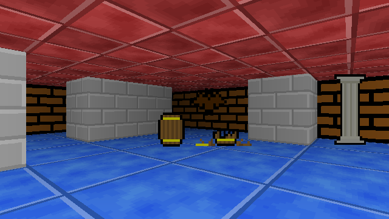

# SDL raycaster sample

## Requirements

 * C++14 compiler
 * SDL 2.0.8
 * CMake 3.11

On macOS, SDL and CMake can be installed through Homebrew:

    brew install sdl2 cmake

## Building

The usual CMake way:

    mkdir build && cd build
    cmake ..
    make

## Running

The binary needs to know where the `assets/` directory is, so it must be run
from the repo root:

    ./build/raycaster

## Controls

* W - move forward
* S - move backward
* A - turn left
* D - turn right
* SPACE - take screenshot
* ESCAPE - quit
